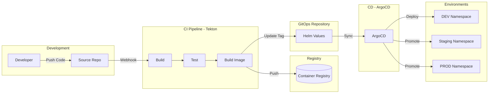
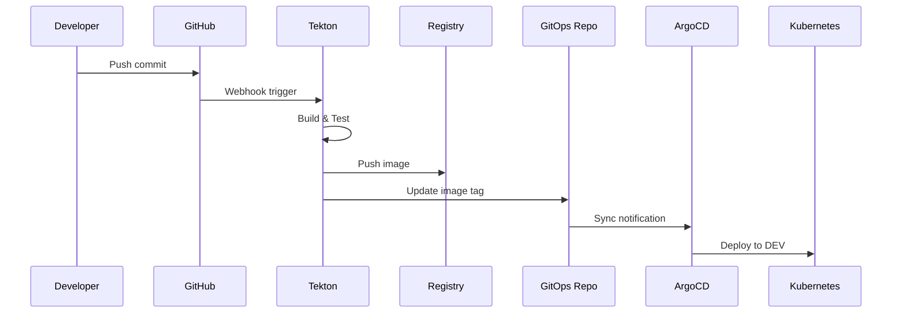
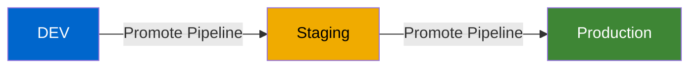

# Architecture

## System Overview

This application follows a GitOps deployment model with three environments: Development, Staging, and Production.



## Deployment Flow

### 1. Code Commit

When a developer pushes code to the source repository:



### 2. Environment Promotion



## Component Architecture

```mermaid
graph TB
    subgraph Pod
        APP[Node.js App]
        APP -->|:8080| SVC
    end

    subgraph Services
        SVC[ClusterIP Service]
        ROUTE[OpenShift Route]
        SVC --> ROUTE
    end

    subgraph Probes
        HEALTH[/health]
        READY[/ready]
        APP --> HEALTH
        APP --> READY
    end

    ROUTE -->|HTTPS| USER[User]
```

## Technology Stack

| Layer | Technology |
|-------|------------|
| **Runtime** | Node.js |
| **Web Framework** | Express |
| **Container** | Podman/Docker |
| **Orchestration** | Kubernetes/OpenShift |
| **CI** | Tekton Pipelines |
| **CD** | ArgoCD |
| **GitOps** | Helm + Kustomize |
| **Registry** | Quay / OpenShift Internal |

## Configuration

### Environment Variables

| Variable | Description | Default |
|----------|-------------|---------|
| `PORT` | Server port | `8080` |
| `NODE_ENV` | Node environment | `production` |
| `APP_ENV` | Application environment | `dev` |

### Resource Allocation

| Environment | CPU Request | CPU Limit | Memory Request | Memory Limit | Replicas |
|-------------|-------------|-----------|----------------|--------------|----------|
| DEV | 100m | 500m | 128Mi | 512Mi | 1 |
| Staging | 200m | 1000m | 256Mi | 1Gi | 2 |
| Production | 500m | 2000m | 512Mi | 2Gi | 3+ |

## Security

- TLS termination at the route level
- Network policies isolate namespaces
- Service accounts with minimal permissions
- Image scanning via Quay (if enabled)
- GitOps ensures audit trail for all changes

